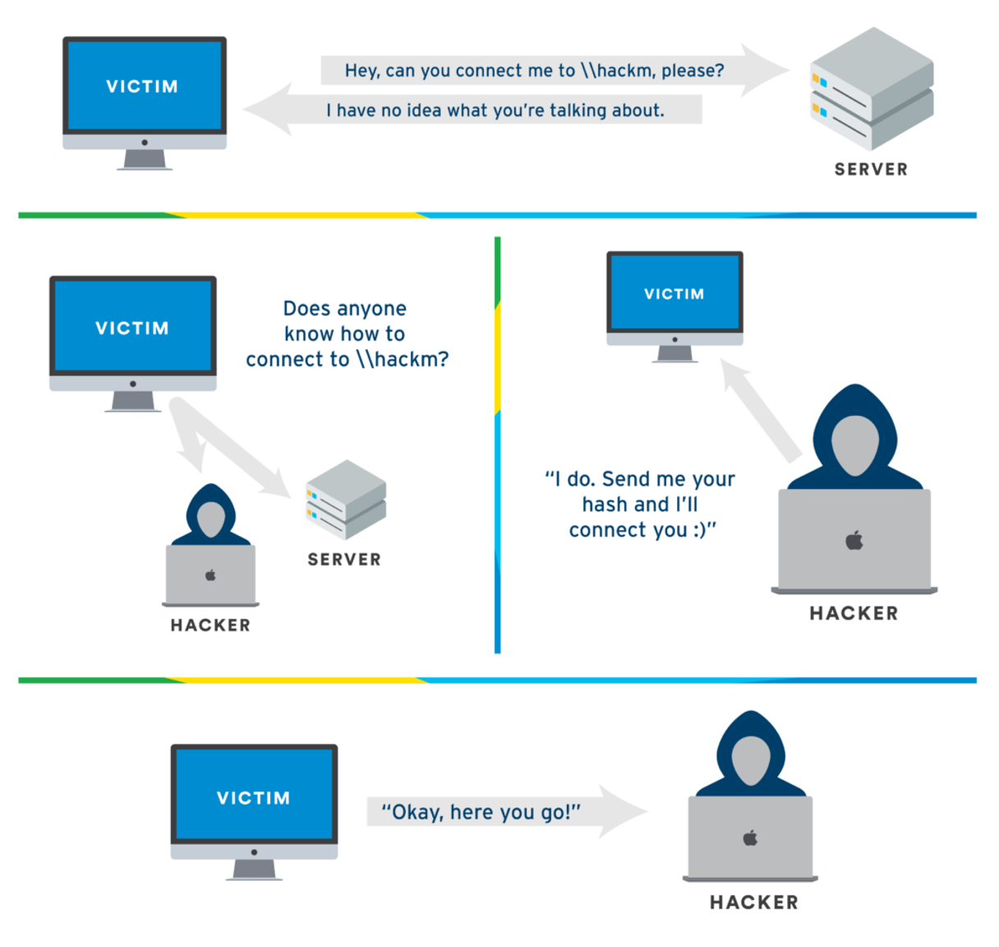
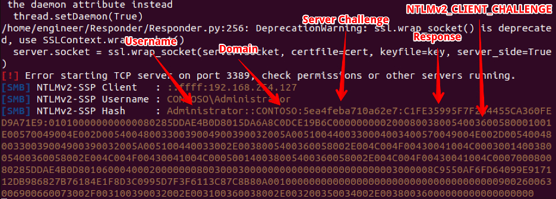
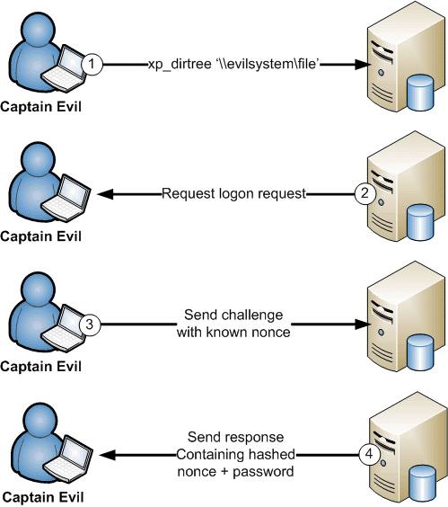
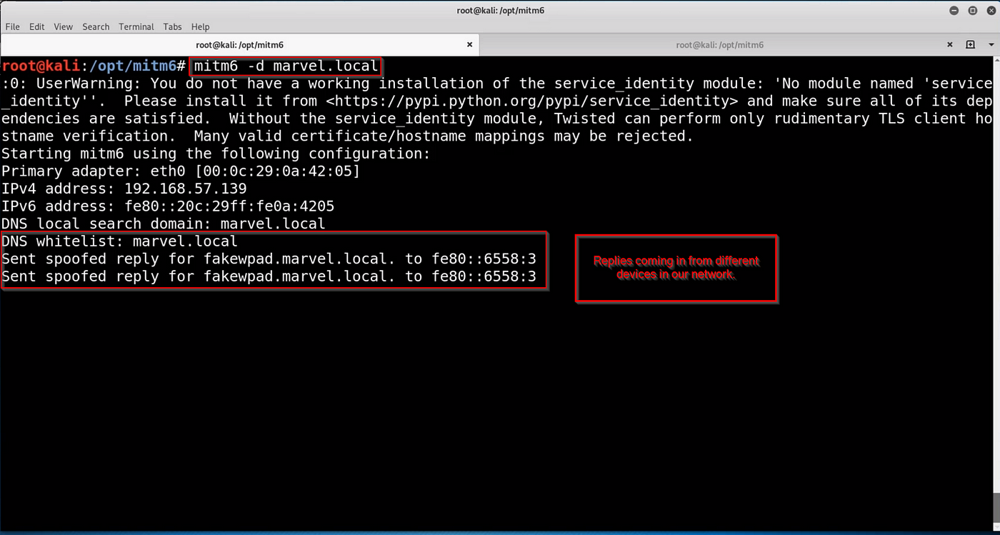
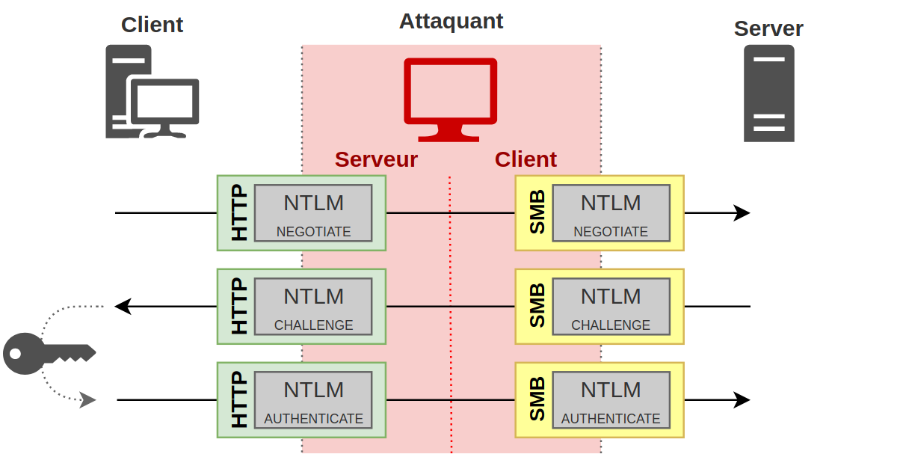
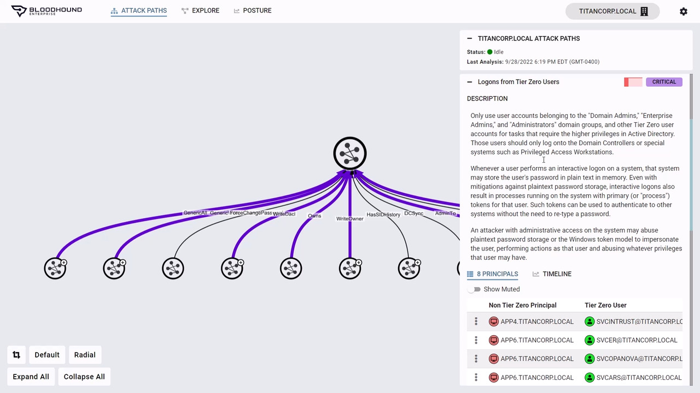
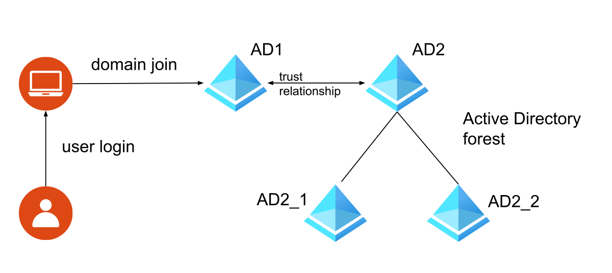
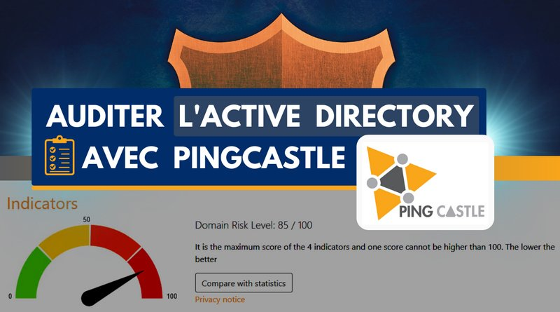
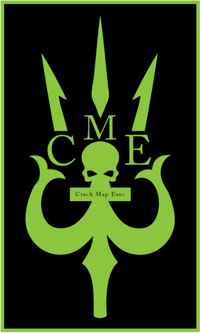
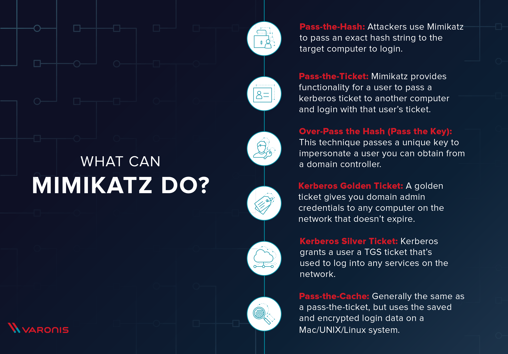

# Rapport Ethical Hacking

### Qu'est-ce que c'est ?

Ce rapport a pour but de présenter les différentes attaques et outils utilisés dans le cadre de l'Ethical Hacking. Il est divisé en trois parties : les vecteurs d'attaques initiaux dans un Active Directory, les post-compromise enumeration et les post-compromise attacks.

## Sommaire : 

[Vecteurs d’attaque initiaux dans un AD](#vecteurs-dattaque-initiaux-dans-un-ad-)

- [LLMNR poisoning](#LLMNR-poisoning-) 
- [Comment capturer les hash NTLM V2](#Comment-capturer-les-hash-NTLM-V2-)
- [Comment craquer les hash NTLM V2](#Comment-craquer-les-hash-NTLM-V2-)
- [Recherche sur les mesures d’atténuation LLMMR poisoning](#Recherche-sur-les-mesures-datténuation-LLMMR-poisoning-)
- [SMB relay attack](#SMB-relay-attack-)
- [Comment avoir un accès shell dans un environnement AD](#Comment-avoir-un-accès-shell-dans-un-environnement-AD-)
- [Attaque ipv6](#Attaque-ipv6-)
- [Outils utilisés pour les attaques ipv6](#Outils-utilisés-pour-les-attaques-ipv6-)
- [Recommandation pour atténuer les attaques ipv6](#Recommandation-pour-atténuer-les-attaques-ipv6-)
- [Passback attack](#Passback-attack-)
- [Autres types d’attaques AD](#Autres-types--)

[Post compromise enumeration :](#post-compromise-enumeration-)

- [Powerview](#Powerview-)
- [Bloodhound quel est son rôle ?](#Bloodhound-quel-est-son-rôle-?)
- [LDAP domain dump](#LDAP-domain-dump-)
- [PlumHound](#PlumbHound-)
- [PingCastle](#PingCastle-)

[Post Compromise Attack:](#post-compromise-attack-)

- [PassTheHash](#PassTheHash-)
- [CrackMapExec](#CrackMapExec-)
- [SecretDump](#SecretDump-)
- [Pass Attack Mitigation](#Pass-attack-mitigatio-)
- [Incognito](#Incognito-)
- [Kerberoasting](#Kerberoasting-)
- [GPP et CPassword](#GPP-et-CPassword)
- [Mimikatz](#Mimikatz)
- [golden tickets](#Golden-tickets)
- [Conclusion](#Conclusion-)

---
<u>

## Vecteur d’attaque initiaux dans un AD
</u>

### LLMNR poisoning :

LLMNR est un protocole **ipv4 et ipv6** qui permet à un ordinateur de <ins>résoudre le nom d'un autre ordinateur sans utiliser de serveur DNS</ins>. Il est utilisé pour résoudre les noms de domaine sur un réseau local lorsque le serveur DNS n'est pas disponible.  
LLMNR est activé par défaut sur les systèmes d'exploitation Windows.

Lorsqu'une requête DNS d'un hôte échoue, l'hôte diffuse une requête LLMNR sur le réseau local pour voir si un autre hôte peut répondre.

On peut donc se poser la question: __**comment ce protocole est-il faillible**__ ?  
Consultons l'image ci-dessous ([source](https://tcm-sec.com/llmnr-poisoning-and-how-to-prevent-it/)) :

Une attaque LLMNR-poisoning est donc une attaque dans laquelle un acteur malveillant **écoute les requêtes LLMNR et répond avec sa propre adresse IP** (ou une autre adresse IP de son choix) pour rediriger le trafic.  
Cela peut conduire au **vol d'informations d'identification** et aux attaques par relais dans Active Directory. Attaques relais que nous voyons dans la partie suivante.

### Comment capturer les hash NTLM V2 :

NTLM est un protocole d'authentification utilisé par les systèmes d'exploitation Windows. Il est utilisé pour authentifier les utilisateurs et les ordinateurs dans un domaine Windows.

Afin de capturer les hash NTLM V2, il est possible d'utiliser des outils comme **Responder** ou **Bettercap**.  
Ces outils permettent de capturer les hash NTLM V2 lorsqu'une requête LLMNR est envoyée sur le réseau.  

### Comment craquer les hash NTLM V2 :

Une fois cela fait, il suffit de bruteforce (ou d'uiliser des rainbow tables) pour obtenir le mot de passe en clair.

Cette attaque est possible grâce à la faiblesse du protocole NTLM qui stocke les mots de passe sous forme de hash, et qui dit hash dit possibilité de le casser.

### Recherche sur les mesures d’atténuation LLMMR poisoning :

Pour atténuer les attaques LLMNR poisoning, il est possible de **désactiver** le protocole LLMNR sur les machines Windows.  
Ce n'est bien sûr pas une vraie solution, mais cela permet de réduire les risques.

Il est également possible de configurer les pare-feux pour bloquer les paquets LLMNR.
Dans tous les cas, il est recommandé de **ne pas utiliser de protocoles non sécurisés** comme LLMNR.  
LLMNR est une faille de par sa nature même, il est donc recommandé de le désactiver.

### SMB relay

SMB relay est une attaque qui consiste à **rediriger le trafic SMB vers un autre hôte**.
Pour cela, il faut que la machine cible soit vulnérable à une attaque de type **NTLM relay**, même si ce n'est pas la seule condition.

Voilà les conditions pour que l'attaque fonctionne :

- La cible ne doit pas appliquer ou activer la signature SMB.
- Pour obtenir des résultats utiles, les informations d’identification de l’utilisateur relayé doivent avoir le statut d’administrateur local sur la machine.
- On ne peut pas relayer les informations d’identification à la même machine à partir de laquelle elles ont été capturées.

**Remarque :** par défaut, la signature SMB est **désactivée** ou non **appliquée** sur tous les postes de travail Windows (non-serveurs).
**Autre remarque :** étant donné que ces informations d’identification sont relayées, la force du mot de passe n’a plus d’importance, et c'est problématique.

On peut se protéger de ce type d'attaque en **activant la signature SMB**.

**Voilà comment fonctionne l'attaque :** [source](https://beta.hackndo.com/ntlm-relay/)

### Comment avoir un accès shell dans un environnement AD :

Pour avoir un accès shell dans un environnement AD, il est possible d'utiliser des outils comme **Empire** ou **Mimikatz**. Le plus simple, étant donné ce que l'on a vu précédemment, est de **capturer des hash NTLM V2** et de les **cracker** pour obtenir les mots de passe en clair.  
Voici les étapes à suivre, en prenant en compte ce que l'on sait sur NTLM V2 : 

1. Capturer les authentifications NTLMv2 : On utilise des outils comme **Responder** pour piéger des requêtes réseau (LLMNR ou SMB) et **récupérer les hashes NTLMv2**.  
2. Exploiter les hashes : On peut les utiliser directement dans une attaque Pass-the-Hash pour s'authentifier sur d'autres machines du domaine sans casser le mot de passe.  
3. Monter en privilèges : Avec un accès à une machine, on cherche à devenir administrateur en capturant d'autres identifiants ou en exploitant des failles.  
4. Obtenir un shell : Une fois admin, on déploie un shell (par exemple avec PsExec ou PowerShell) pour prendre le contrôle d'une machine.  

### Attaque ipv6 :

Les attaques ipv6 sont des attaques qui exploitent les failles du protocole ipv6.  
Les attaques IPv6 sur Microsoft Active Directory exploitent souvent le fait que le protocole IPv6 est activé par défaut sur les systèmes Windows, même si le réseau n'est pas configuré pour l'utiliser

On peut simuler un routeur IPv6 malveillant. Les machines clientes Windows basculent automatiquement vers IPv6 si elles détectent un routeur actif, redirigeant leur trafic vers l'attaquant.
De là, l'attaquant peut capturer des informations d'identification, des données sensibles ou même rediriger le trafic vers des serveurs malveillants.  
On peut même utiliser ce que l'on a vu précédemment pour capturer des hash NTLM V2.

### Outils utilisés pour les attaques ipv6 :

Il existe évidemment une multitude d'outils pour réaliser des attaques ipv6, mais voici les principaux (à mon avis.) :

- **Mitm6** : un outil qui permet de simuler un routeur IPv6 malveillant pour capturer le trafic réseau.
- **Responder** : pour capturer des hash NTLM V2, même en ipv6.
- **Relay6** : pour relayer des informations d'identification NTLMv2.

### Recommandation pour atténuer les attaques ipv6 :

Encore une fois, on a affaire à un protocole qui est activé par défaut sur les machines Windows, et un man in the middle.  
Pour atténuer les attaques ipv6, il est possible de **désactiver** le protocole ipv6 sur les machines Windows. (Ou au moins, il faut penser à bien le configurer...)

Il est également possible de configurer les pare-feux pour bloquer les paquets ipv6.  
Enfin, on peut activer le SMB signing pour éviter les attaques de type SMB relay.

### Passback attack :

La passback attack est une attaque qui consiste à **relayer des informations d'identification NTLMv2**.  
Au lieu de récupérer les hash NTLMv2 pour les casser, on les relaie vers une autre machine pour obtenir un accès.  
Cette attaque est d'autant plus vicieuse qu'elle ne nécessite pas de casser les hash NTLMv2, et qu'elle peut être réalisée en quelques secondes. (pas besoin de puissance de calcul)
[Source de l'image](https://beta.hackndo.com/ntlm-relay/#channel-binding)

### Autres types :

Il existe bien sûr d'autres types d'attaques sur Active Directory, mais celles-ci sont les plus courantes.
On peut notemment citer : 
- **Attaques de type Golden Ticket** : qui consistent à générer un ticket Kerberos valide pour un utilisateur.
- **Attaques de type Silver Ticket** : qui consistent à générer un ticket Kerberos valide pour un service.
- **Attaques de type DCSync** : qui consistent à récupérer les mots de passe des comptes AD.
- **Attaques de type DCShadow** : qui consistent à injecter des objets dans l'AD sans être détecté.

Et bien d'autres encore.

## Post-compromise enumeration :

Après avoir compromis un système, il est important de réaliser une phase d'enumeration pour comprendre le réseau, la machine et les systèmes auxquels on a accès.  
Bref, il est important de faire un tour du propriétaire.

### Powerview :

Powerview est un outil PowerShell qui permet de réaliser des requêtes sur un Active Directory compromis.
Il permet de récupérer des informations sur les utilisateurs, les groupes, les machines, les GPO, les ACL, etc.
Voilà comment il fonctionne :

- Tout d'abord, il faut **charger le module** Powerview dans PowerShell.
- Ensuite, on peut réaliser des requêtes pour récupérer des informations sur le domaine.
- Par exemple, on peut récupérer les utilisateurs du domaine, les groupes, les machines, les GPO, etc.
- On peut également réaliser des requêtes plus complexes pour récupérer des informations sur les ACL, les sessions, etc.
- Enfin, on peut exporter ces informations dans un fichier pour les analyser plus tard.

### Bloodhound: quel est son rôle ?

Bloodhound est un outil qui permet de **visualiser les relations entre les objets d'un Active Directory**.  
Il permet de visualiser les relations entre les utilisateurs, les groupes, les machines, les GPO, etc.  
Il permet également de visualiser les chemins d'accès possibles pour un attaquant.  
Son fonctionnement est simple. Il suffit de **lancer l'agent** sur un poste compromis, de **collecter les données** et de les **importer** dans l'interface graphique de Bloodhound.

### LDAP domain dump :

LDAP domain dump est un outil qui permet de **récupérer des informations sur un domaine Active Directory**.  
Il permet de récupérer des informations sur les utilisateurs, les groupes, les machines, les GPO, etc.  
Il permet également de récupérer des informations sur les ACL, les sessions, etc.  
À la différence de bloodhound, il ne permet pas de visualiser les relations entre les objets, mais il permet de récupérer des informations plus précises.  
L'outil se base sur des requêtes LDAP pour récupérer ces informations; En effet, LDAP est un protocole qui permet de récupérer des informations sur un annuaire. Qui dit Active Directory, dit LDAP, qui dit LDAP, dit informations sur le domaine.

### PlumHound :

Encore un outil qui permet de visualiser les relations entre les objets d'un Active Directory.
Il s'agit d'un outil open-source qui permet de visualiser les relations entre les utilisateurs, les groupes, les machines, les GPO, etc comme le fait Bloodhound ou même LDAP domain dump.
PlumHound n'est pas à voir comme un outil séparé de Bloodhound, mais plutôt comme un complément. En effet, on voit souvent des articles parlant de leur utilisation conjointe.

BloodHound se concentre sur les permissions et les relations dans AD, tandis que PlumHound cible spécifiquement les vulnérabilités qui peuvent être exploitées pour se déplacer dans le réseau ou élever ses privilèges.  
On peut donc voir bloodhound comme un outil de cartographie du réseau, et PlumHound comme un outil de recherche de vulnérabilités.

### PingCastle :

PingCastle est un outil qui permet de réaliser un audit de sécurité sur un Active Directory.  
Plus précisément, il permet de réaliser un audit de sécurité sur les GPO, les utilisateurs, les groupes, les machines... Un peu à la manière de Powerview, mais en plus complet.  
Par exemple, PingCastle permet de détecter les comptes inutilisés, les mots de passe faibles, les GPO mal configurées et il permet également de générer des livrables.  
Les rapport générés par PingCastle sont très complets et permettent de mettre en lumière les failles de sécurité d'un Active Directory.  

## Post-compromise attacks :

Après avoir réalisé une phase d'énumeration, il est possible de réaliser des attaques post-compromise pour étendre son impact sur le réseau.
Pour ce faire, il existe encore une fois une multitude d'outils et de techniques, mais voici les plus courantes.

### PassTheHash :

PassTheHash est une attaque qui consiste à **utiliser des hash NTLMv2 pour s'authentifier sur un autre système**.  
Cette attaque permet de s'authentifier sur un autre système sans connaître le mot de passe en clair, en utilisant le hash NTLMv2, sans le déchiffrer, simplement en le passant en paramètre de la requête.  
Cette attaque ressemble à une attaque de type SMB relay, mais elle est plus simple à réaliser et elle ne nécessite pas de relayer les informations d'identification.  

### CrackMapExec :

CrackMapExec est un outil qui permet de réaliser des attaques sur un Active Directory compromis.  
Ce tool permet de réaliser des attaques de type PassTheHash, mais il permet également de réaliser des attaques de type DCSync, des attaques de type Golden Ticket, etc.  
Ce logiciel est décrit par kali Linux comme "Ce package est un véritable couteau suisse pour les tests d'intrusion dans les environnements Windows/Active Directory.  
De l'énumération des utilisateurs connectés et de l'exploration des partages SMB à l'exécution d'attaques de style psexec, en passant par l'auto-injection de Mimikatz/Shellcode/DLL dans la mémoire à l'aide de Powershell, le vidage du NTDS.dit et bien plus encore."

### SecretDump :

SecretDump est un outil qui permet de **récupérer les mots de passe stockés dans la mémoire**.  
Il permet de récupérer les mots de passe stockés dans la mémoire, les mots de passe stockés dans les GPO, les mots de passe stockés dans les services, etc.  
C'est clairement un tool de Forensic. Il peut également être utilisé pour récupérer les mots de passe stockés dans les navigateurs, les mots de passe stockés dans les fichiers, ou encore les mots de passe stockés dans les fichiers de configuration.  

### Pass attack mitigation :

Pour atténuer les attaques de type PassTheHash, il est possible de **désactiver le protocole NTLM** sur les machines Windows.
Il est également possible de **configurer les pare-feux** pour bloquer les paquets NTLM.
Enfin, il est possible de **configurer les GPO** pour limiter l'utilisation des hash NTLM.

En gros, il faut **limiter l'utilisation des hash NTLM** pour limiter les risques d'attaques de type PassTheHash.
C'est en ça que les attaques de type PassTheHash sont dangereuses, car elles permettent de s'authentifier sur un autre système sans connaître le mot de passe en clair.
Une mitigation efficace est donc de limiter l'utilisation des hash NTLM. 
Comme le disait l'auteur de l'article du site hackndo.com, "Pitié arrêtez d'utiliser NTLM".

### Incognito :

Incognito est un outil qui permet de **mimer un ticket Kerberos**.  
Concrètement, il permet de générer un ticket Kerberos valide pour un utilisateur, sans connaître son mot de passe.  
C'est une attaque de type Golden Ticket, qui permet de s'authentifier sur un autre système sans connaître le mot de passe en clair.  
Cette attaque est très puissante, car elle permet de s'authentifier sur n'importe quel système du domaine, sans connaître le mot de passe en clair.

Voici comment incognito explique son fonctionnement :  
En un mot, les jetons sont comme les cookies Web. Il s'agit d'une clé temporaire qui vous permet d'accéder au système et au réseau sans avoir à fournir d'informations d'identification à chaque fois que vous accédez à un fichier. Incognito exploite cela de la même manière que le vol de cookies, en réexécutant cette clé temporaire lorsqu'on lui demande de s'authentifier.

### Kerberoasting :

Le Kerberoasting est une technique d'attaque post-exploitation qui tente de craquer le mot de passe d'un compte de service au sein d'Active Directory (AD).

Dans ce type d'attaque, un cyberadversaire se faisant passer pour l'utilisateur d'un compte avec un nom de principal de service (SPN, Service Principal Name) demande un ticket qui contient un mot de passe chiffré, ou Kerberos. (Le SPN est un attribut qui lie un service à un compte utilisateur dans AD.) Le cyberadversaire tente ensuite de craquer le hachage du mot de passe hors ligne, souvent en recourant à des techniques d'attaque par force brute.

Une fois les identifiants en texte brut du compte de service exposés, le cyberadversaire est en possession des identifiants utilisateur, qu'il peut alors utiliser pour usurper l'identité du propriétaire du compte. Il se donne ainsi toutes les apparences d'un utilisateur approuvé et légitime et peut accéder sans restriction à tout système, ressource ou réseau auquel le compte compromis a accès. [Source :](https://www.crowdstrike.com/fr-fr/cybersecurity-101/cyberattacks/kerberoasting/?srsltid=AfmBOorm4DpYOI7icsrFKaWGRjiVSGw8VU_KMYyTEilqydu2mDHtCOsh)

### GPP et CPassword :

Les GPP (Group Policy Preferences) sont des objets de stratégie de groupe qui permettent de stocker des mots de passe en clair dans Active Directory.  
Ces mots de passe sont stockés dans des fichiers XML, et ils sont chiffrés avec une clé statique.  
Il est donc possible de récupérer ces mots de passe en chiffrant la clé statique avec une clé publique, et en déchiffrant les mots de passe avec la clé privée.
Les attaques de type GPP sont donc très dangereuses, car elles permettent de récupérer des mots de passe en clair dans Active Directory. Et c'est un peu la base de la sécurité informatique de ne pas stocker de mots de passe en clair...
La clé statique utilisée pour chiffrer les mots de passe GPP est connue, et il est donc possible de les récupérer en utilisant des outils comme Mimikatz.

### Mimikatz :

Mimikatz est un outil qui permet de **récupérer les mots de passe stockés dans la mémoire**.  
Il rejoint donc ce que l'on a vu précédemment avec GPP et Cpassword, mais il permet également de récupérer les mots de passe stockés dans les GPO, les mots de passe stockés dans les services, etc.  
Au delà de ça, Mimikatz est vraiment un couteau suisse de la sécurité informatique. Il permet de réaliser presque toutes les attaques citées précédemment, comme le PassTheHash, le Kerberoasting, le Golden Ticket, etc.  
C'est un outil très puissant, mais il est également très dangereux. Il est donc important de le connaître pour se protéger de ses attaques.  
Cocorico, Mimikatz a été créé par un français, Benjamin Delpy.

### Golden tickets :

Les Golden tickets sont des tickets Kerberos valides pour un utilisateur.  
Concrètement, il s'agit de générer un ticket Kerberos valide pour un utilisateur, sans connaître son mot de passe.  
C'est une attaque de type PassTheHash, qui permet de s'authentifier sur un autre système sans connaître le mot de passe en clair.  
Cette attaque est très puissante, car elle permet de s'authentifier sur n'importe quel système du domaine, sans connaître le mot de passe en clair.  
Les Golden tickets sont très dangereux, car ils permettent de s'authentifier sur n'importe quel système du domaine, sans connaître le mot de passe en clair.  
Il est donc important de se protéger de ces attaques en limitant l'utilisation des hash NTLM, en activant la signature SMB, etc.  

### Conclusion :

Au terme de ce rapport, on peut dire que l'Active Directory est un élément vraiment sensible dans un réseau d'entreprise.  
Il est donc important de le sécuriser, notemment en désactivant les protocoles non sécurisés comme LLMNR, en limitant l'utilisation des hash NTLM, en activant la signature SMB, etc.  
Il est également important de réaliser des phases d'énumeration et de post-compromise pour comprendre le réseau, la machine et les systèmes auxquels on a accès.  
Enfin, il est important de se protéger des attaques de type PassTheHash, Kerberoasting, Golden Ticket, etc. en limitant l'utilisation des hash NTLM, en activant la signature SMB, etc.  
On peut donc dire sans crainte que les protocoles type NTLM sont à éviter, car ces protocoles sont complètement troués.  

